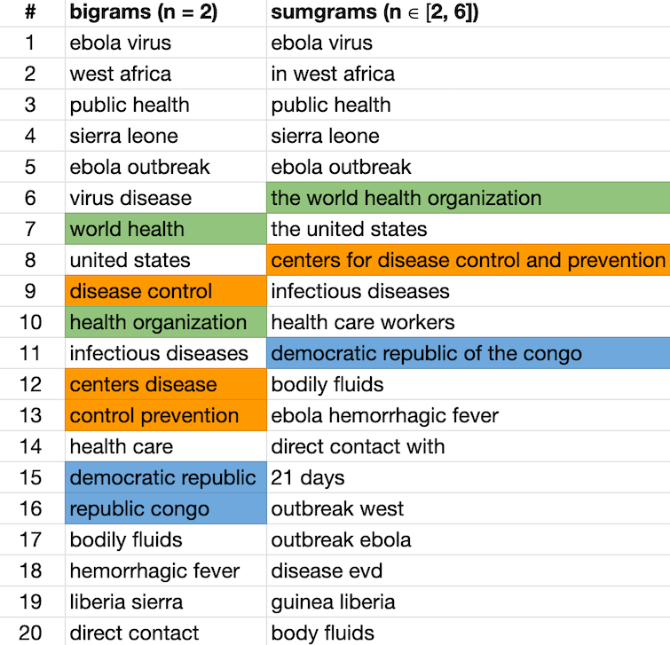
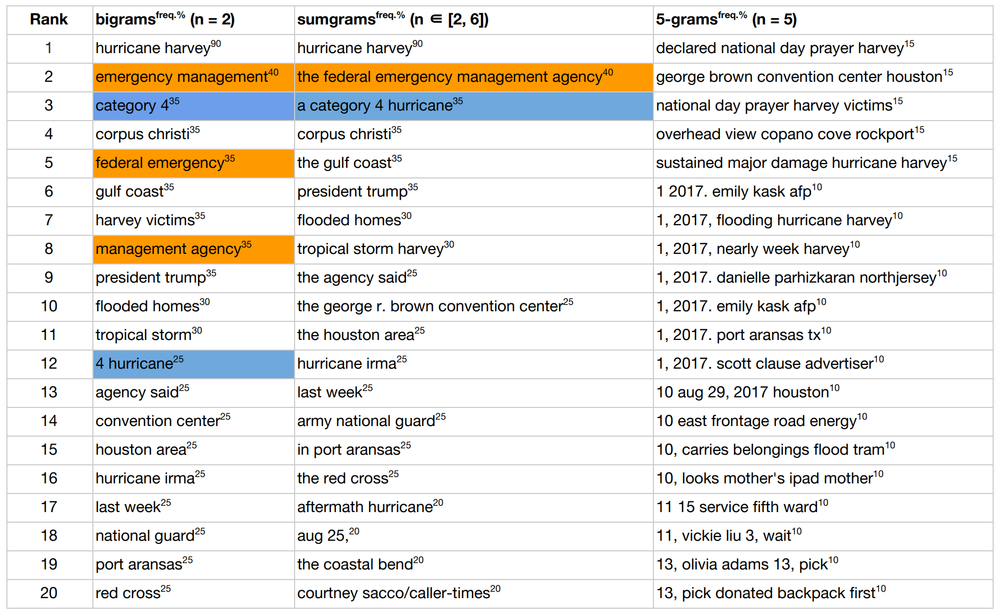
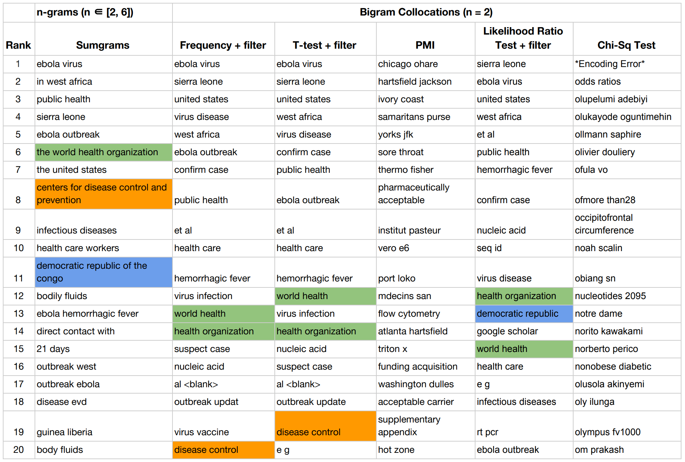
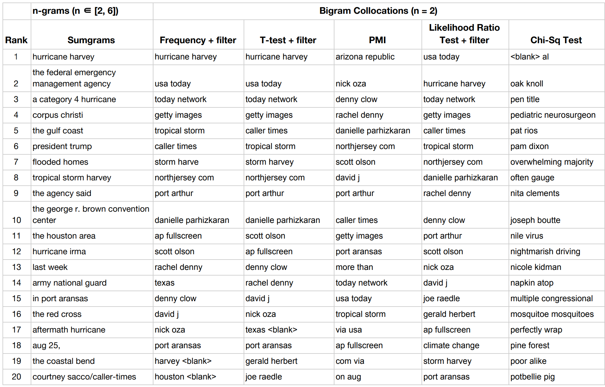
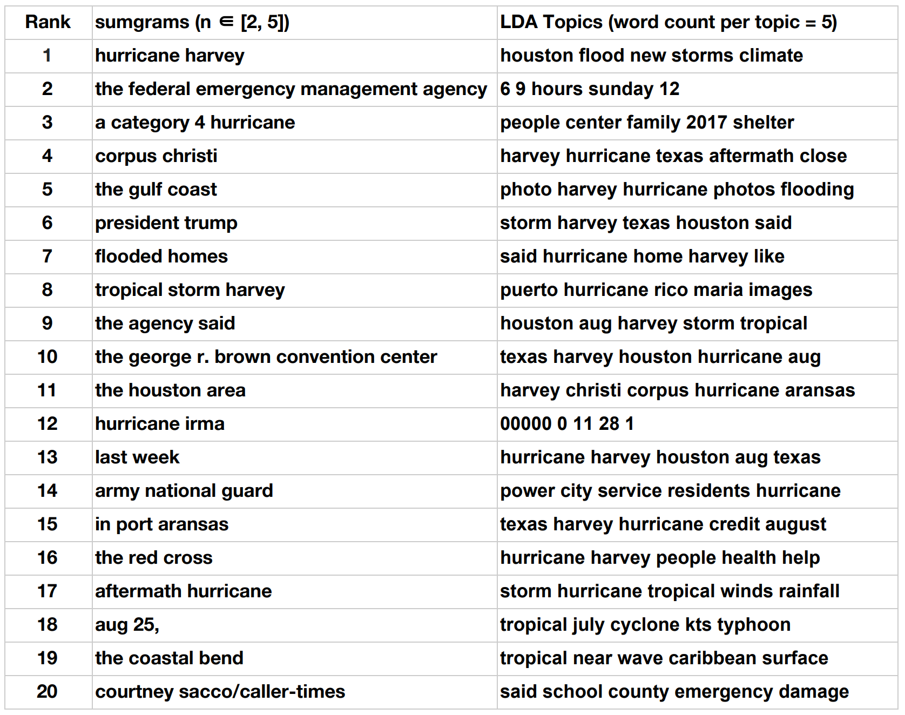

# [sumgram](https://ws-dl.blogspot.com/2019/09/2019-09-09-introducing-sumgram-tool-for.html)

sumgram ([see blogpost](https://ws-dl.blogspot.com/2019/09/2019-09-09-introducing-sumgram-tool-for.html)) is a tool that summarizes a collection of text documents by generating the most frequent "sumgrams" (conjoined ngrams) in the collection. Sumgrams are higher-order ngrams (e.g., `"world health organization"`) generated by conjoining lower-order ngrams (e.g., `"world health"` and `"health organization"`). Unlike convention ngram generators that split multi-word proper nouns, sumgram works hard to avoid this by applying two ([`pos_glue_split_ngrams`](#pos_glue_split_ngrams) and [`mvg_window_glue_split_ngrams`](#mvg_window_glue_split_ngrams)) algorithms. These algorithms enable sumgram to generate conjoined ngrams, or sumgrams of different ngram classes (bigrams, trigrams, k-grams, etc.) as part of the summary, instead of limiting the summary to a single ngram class (e.g., bigrams).

From Fig. 1, the six-gram `"centers for disease control and prevention"` was split (stopwords removed) into 3 different bigrams (`"centers disease,"` `"disease control,"` and `"control prevention"`) by a conventional algorithm that generates bigrams. But sumgram detected and "glued" such split ngrams.

*Fig. 1: Comparison of top 20 (first column) bigrams, top 20 (second column) six-grams, and top 20 (third column) sumgrams (conjoined ngrams) generated by sumgram for a collection of documents about the [2014 Ebola Virus Outbreak](https://en.wikipedia.org/wiki/Western_African_Ebola_virus_epidemic). Proper nouns of more than two words (e.g., `"centers for disease control and prevention"`) are split when generating bigrams, sumgram strives to remedy this. Generating six-grams surfaces non-salient six-grams.*


*Fig. 2: Comparison of top 20 (first column) bigrams, top 20 (second column) six-grams, and top 20 (third column) sumgrams (conjoined ngrams) generated by sumgram for a collection of documents about [Hurricane Harvey](https://en.wikipedia.org/wiki/Hurricane_Harvey). Proper nouns of more than two words (e.g., `"federal emergency management agency"`) are split when generating bigrams, sumgram strives to remedy this. Generating six-grams surfaces non-salient six-grams.*


## Citing Project
A publication related to this project appeared in the proceedings of ACM Conference on Hypertext and Social Media 2018 ([Read the PDF](https://www.cs.odu.edu/~mln/pubs/ht-2018/hypertext-2018-nwala-bootstrapping.pdf)). Please cite it as below:

> Nwala, Alexander C., Michele C. Weigle, and Michael L. Nelson. "Bootstrapping web archive collections from social media." in Proceedings of ACM Conference on Hypertext and Social Media, pp. 64-72. 2018.

```latex
@inproceedings{ht-2018:nwala,
  author    = {Nwala, Alexander C and Weigle, Michele C and Nelson, Michael L},
  title     = {{Bootstrapping Web Archive Collections from Social Media}},
  booktitle = {Proceedings of ACM Conference on Hypertext and Social Media (HT 2018)},
  series    = {HT '18},
  year      = {2018},
  month     = {jul},
  location  = {Baltimore, Maryland, USA},
  pages     = {64--72},
  numpages  = {9},
  url       = {https://doi.org/10.1145/3209542.3209560},
  doi       = {10.1145/3209542.3209560},
  isbn      = {9781450354271},
  publisher = {ACM},
  address   = {New York, NY, USA}
}
```

## Installation
Just type
```
$ pip install sumgram
```
OR
```
$ git clone https://github.com/oduwsdl/sumgram.git
$ cd sumgram; pip install .; cd ..; rm -rf sumgram;
```
OR install/run within Docker container
```
$ docker run -it --rm --name Sumgram -v "$PWD":/usr/src/myapp -w /usr/src/myapp python:3.7-stretch bash
$ pip install sumgram
```
OR install/run in locally built docker image
```
$ git clone https://github.com/oduwsdl/sumgram.git
$ cd sumgram
$ docker build -t wsdl/sumgram .
$ cd ..; rm -rf sumgram;
$ docker run --rm -it -v "$PWD":/data/ wsdl/sumgram
```
OR install/run from Dockerhub: coming soon

## Usage
### Basic usage:
* `$ sumgram path/to/collection/of/text/files/`,
e.g., sumgram [tests/unit/sample_cols/harvey](tests/unit/sample_cols/harvey)
* `$ sumgram single_file.txt`,
e.g., sumgram [tests/unit/sample_cols/harvey/single_file.txt](tests/unit/sample_cols/harvey/08803837d3fc3c13dd29d3181d7e9cb2.txt)
* `$ sumgram https://www.example.com/news/article-1.html https://www.example.com/news/article-2.html`
* `$ sumgram path/to/collection/ file2.txt file3.txt https://www.example.com/news/article-1.html`
* `$ cat path/to/collection/of/text/files/*.txt | sumgram -`

### Python script usage:
[Command line options](#full-usage) may be activated by setting the argument in the `params` dictionary passed as an argument to `get_top_sumgrams()`. To set a command line argument, consider the following transformation example:

```
params = {}
params['sentences_rank_count'] = 20  #For command line argument --sentences-rank-count
```

The following is a Python script example illustrating the use of sumgram done by calling the `get_top_sumgrams()` function.
```
import json
from sumgram.sumgram import get_top_sumgrams

doc_lst = [
    {'id': 0, 'text': 'The eye of Category 4 Hurricane Harvey is now over Aransas Bay. A station at Aransas Pass run by the Texas Coastal Observing Network recently reported a sustained wind of 102 mph with a gust to 132 mph. A station at Aransas Wildlife Refuge run by the Texas Coastal Observing Network recently reported a sustained wind of 75 mph with a gust to 99 mph. A station at Rockport reported a pressure of 945 mb on the western side of the eye.'},
    {'id': 1, 'text': 'Eye of Category 4 Hurricane Harvey is almost onshore. A station at Aransas Pass run by the Texas Coastal Observing Network recently reported a sustained wind of 102 mph with a gust to 120 mph.'},
    {'id': 2, 'text': 'Hurricane Harvey has become a Category 4 storm with maximum sustained winds of 130 mph. Sustained hurricane-force winds are spreading onto the middle Texas coast.'}
  ]

'''
  Use 'add_stopwords' to include list of additional stopwords not included in stopwords list (https://github.com/oduwsdl/sumgram/blob/0224fc9d54034a25e296dd1c43c09c76244fc3c2/sumgram/util.py#L31)
'''
params = {
    'top_sumgram_count': 10,
    'add_stopwords': ['image'],
    'no_rank_sentences': True,
    'title': 'Top sumgrams for Hurricane Harvey text collection'
}

ngram = 2
sumgrams = get_top_sumgrams(doc_lst, ngram, params=params)
with open('sumgrams.json', 'w') as outfile:
  json.dump(sumgrams, outfile)
```
### Examples (see sample collection [tests/unit/sample_cols/harvey](tests/unit/sample_cols/harvey)):
### Generate top 10 (t = 10) sumgrams for the [Archive-It Ebola Virus Collection](https://archive-it.org/collections/4887):
```
$ sumgram -t 10 cols/ebola/
 rank  sumgram                                              DF   DF-Rate
  1    in west africa                                       50    0.35 
  2    liberia and sierra leone                             46    0.33 
  3    ebola virus                                          44    0.31 
  4    ebola outbreak                                       41    0.29 
  5    public health                                        40    0.28 
  6    the centers for disease control and prevention       23    0.16 
  7    the united states                                    23    0.16 
  8    the world health organization                        22    0.16 
  9    ebola patients                                       20    0.14 
  10   health workers                                       20    0.14 
``` 
### Generate top 10 (t = 10) sumgrams for the [Archive-It Hurricane Harvey Collection](https://archive-it.org/collections/9323):
```
$ sumgram -t 10 cols/harvey/
rank   sumgram                                              DF   DF-Rate
  1    hurricane harvey                                     20    0.47 
  2    tropical storm harvey                                10    0.23 
  3    2017 houston transtar inc.                           9     0.21 
  4    2017. photo                                          9     0.21 
  5    corpus christi                                       9     0.21 
  6    image 28 of                                          9     0.21 
  7    image 29 of                                          9     0.21 
  8    image 30 of                                          9     0.21 
  9    image 31 of                                          9     0.21 
  10   image 32 of                                          9     0.21
``` 
This collection has lots of images, but the "image" term might obscure more salient ngrams, so let's 
rerun the command, but this time consider "image" a stopword (`--add-stopwords="image"`). As seen below such modification exposed more salient bigrams such as "buffalo bayou" and "coast guard".
The argument of `--add-stopwords` is a comma-separated string of stopwords (e.g., "image, photo, image of"). Use this parameter to add domain specific stopwords not included in [sumgram's default stopwords list](https://github.com/oduwsdl/sumgram/blob/0224fc9d54034a25e296dd1c43c09c76244fc3c2/sumgram/util.py#L31).

```
$ sumgram -t 10 --add-stopwords="image" cols/harvey/
 rank  sumgram                                              DF   DF-Rate
  1    hurricane harvey                                     20    0.47 
  2    tropical storm harvey                                10    0.23 
  3    2017 houston transtar inc.                           9     0.21 
  4    2017. photo                                          9     0.21 
  5    corpus christi                                       9     0.21 
  6    texas photo                                          9     0.21 
  7    27, 2017                                             8     0.19 
  8    buffalo bayou                                        8     0.19 
  9    coast guard                                          8     0.19 
  10   harvey photo                                         8     0.19 
``` 

### Use application from Python Docker container to generate top 10 (t = 10) sumgrams for the [Archive-It Hurricane Harvey Collection](https://archive-it.org/collections/9323):
```
$ docker run -it --rm --name my-running-script -v "$PWD":/usr/src/myapp -w /usr/src/myapp --network=host python:3.7-stretch bash
$ pip install sumgram
$ sumgram -t 10 --add-stopwords="image" cols/harvey/
 rank  sumgram                                              DF   DF-Rate
  1    hurricane harvey                                     20    0.47 
  2    tropical storm harvey                                10    0.23 
  3    2017 houston transtar inc.                           9     0.21 
  4    2017. photo                                          9     0.21 
  5    corpus christi                                       9     0.21 
  6    texas photo                                          9     0.21 
  7    27, 2017                                             8     0.19 
  8    buffalo bayou                                        8     0.19 
  9    coast guard                                          8     0.19 
  10   harvey photo                                         8     0.19 
``` 

### Generate top sumgrams from collection of URLs:
This requires dereferencing the URLs and [removing the HTML boilerplate](https://ws-dl.blogspot.com/2017/03/2017-03-20-survey-of-5-boilerplate.html). This example requires the [installation of NwalaTextUtils](https://github.com/oduwsdl/NwalaTextUtils).
```
import json
from NwalaTextUtils.textutils import parallelGetTxtFrmURIs
from sumgram.sumgram import get_top_sumgrams

ngram = 2
uris_lst = [
  'http://www.euro.who.int/en/health-topics/emergencies/pages/news/news/2015/03/united-kingdom-is-declared-free-of-ebola-virus-disease',
  'https://time.com/3505982/ebola-new-cases-world-health-organization/',
  'https://www.scientificamerican.com/article/why-ebola-survivors-struggle-with-new-symptoms/'
]

doc_lst = parallelGetTxtFrmURIs(uris_lst)
sumgrams = get_top_sumgrams(doc_lst, ngram)

with open('sumgrams.json', 'w') as outfile:
    json.dump(sumgrams, outfile)
```

### Sumgram output
Highlights of selected fields in the output ([harvey_sumgrams.json](sumgram/harvey_sumgrams.json)) generated from the following command.
```
sumgram -t 20 -o harvey_sumgrams.json --pretty-print cols/harvey/
```
- **base_ngram** (int)
- **top_sumgram_count** (int)
- **ranked_docs** (optional, default ON) array[objects]): 
    - (object)
        - **score**: [Score assigned to document](#ranking-sentences---no-rank-docs-to-switch-off) (int)
        - **doc_id**: auto-generated identifier for document (int)
        - **doc_details** (object): user-supplied document details 
- **ranked_sentences** (optional, default ON) (array[objects]): 
    - (object)
    - **avg_overlap** (float): Average overlap between sentence and all the different top sumgrams
    - **sentence** (string)
    - **doc_indx** (int): Integer position of document where sentence was extracted
    - **doc_id** (int)
    - **sent_indx** (int): Integer position of sentence within document sentence was extracted
    - **segmenter** (string): Method (ssplit or regex) used for segmenting this sentence
- **top_sumgrams**: array[objects])
    - (object)
    - **ngram** (string): ngram or sumgram (conjoined ngram)
    - **base_ngram** (string): root ngram that was expanded to produce the coinjoined ngram. Only present when `sumgram_history` is present.
    - **term_freq** (int): The total number of times ngram occurs in the collection. Every ngram is counted once within a document if the collection contains multiple documents (`term_freq = Document Frequency`), but not if the collection has a single document (`term_freq = Term Frequency`). 
    - **term_rate** (int): `term_freq` as fraction of total collection
    - **parent_sentences** array[objects]: sentences that mention `ngram` 
    - **sumgram_history** array[objects]: historical information showing how `ngram` was was conjoined to form a sumgram 
    - (object)
        - **prev_ngram** (string): previous state of `ngram`
        - **annotator** (string): annotator ([pos](#pos_glue_split_ngrams) or [mvg_window](#mvg_window_glue_split_ngrams)) responsible for conjoining ngrams to form sumgram
        - **cur_ngram** (string): current state of `ngram`
        - **cur_freq** (int): occurrence frequency of `cur_ngram`
        - **cur_pos_sequence** (array[string]): [Part of Speech labels](https://www.ling.upenn.edu/courses/Fall_2003/ling001/penn_treebank_pos.html) of `cur_ngram`
- **params** (objects)

## Counting Term Frequencies
It is important to note that because sumgram was designed to generate top ngrams (summary) in a collection of text documents, it uses document frequencies (if the collection has more than one document). For example, consider the document frequency of `"ebola virus"` in the following collection of three documents,
```
Collection of 3 documents:

Document 1: "ebola virus" occurs 50 times 
Document 2: "ebola virus" occurs 15 times 
Document 3: "ebola virus" occurs 5  times 

According to sumgram, the document frequency (DF) of "ebola virus" is 3 NOT 70
```
According to sumgram, the document frequency of the term `"ebola virus"` is 3 NOT 70! Since the goal is to summarize the collection, documents are given a single vote for a single term, so as not to favor any (e.g., long) document or any term (e.g., very popular term within a few documents). However, if the collection contains a single document, term frequencies are used:
```
Collection of 1 document:
Document 1: "ebola virus" occurs 50 times 
According to sumgram, the TF of "ebola virus" is 50 NOT 1
```
Irrespective of the case (single-document or multi-document collection) sumgram uses `term_freq` to count the frequency of terms.
## Additional Features
In addition to generating top sumgrams, sumgram ranks sentences and documents.
### Ranking documents (`--no-rank-docs` to switch off)
`get_ranked_docs()` ranks documents by giving credit to documents that have highly ranked terms in the ranked list of ngrams. A document's score is awarded by accumulating the points awarded by the position of terms in the ranked list of ngrams. Please note that documents without terms in ranked list of ngrams are not awarded points. Therefore, some documents may not be ranked because they performed poorly - did not have any term in the ranked list of ngrams.

### Ranking sentences (`--no-rank-sentences` to switch off)
`rank_sents_frm_top_ranked_docs()` ranks sentences in the top ranked documents exclusively, and gives credit to sentences with a high average overlap between the sentence tokens and the tokens in the top ngrams. For all sentences in a top ranked documents, a sentence's score (average overlap) is measured by calculating the average overlap between the terms in the top ngrams and the given sentence. This accounts for how many different tokens in the top ngrams that are present in a sentence.

## Recommended Requirement and Performance Considerations
### Recommended Requirement
For the best results, we recommend [installing and running Stanford CoreNLP Server](https://ws-dl.blogspot.com/2018/03/2018-03-04-installing-stanford-corenlp.html) for two reasons.
First, the "pos" in [`pos_glue_split_ngrams`](#pos_glue_split_ngrams) stands for Parts Of Speech (POS). This algorithm needs a POS annotator in order to "glue" split ngrams, hence the need for Stanford CoreNLP server. However, if you do not install Stanford CoreNLP Server, sumgram is robust enough to attempt to glue split ngrams with the second algorithm [`mvg_window_glue_split_ngrams`](#mvg_window_glue_split_ngrams). 

Second, as part of ranking sentences, sumgram needs to segment the sentences in the documents. Stanford CoreNLP's [`ssplit`](https://stanfordnlp.github.io/CoreNLP/ssplit.html) annotator splits sentences after tokenization, and exploits the decisions of the tokenizer. Probabilitic methods (such as `ssplit`) for segmenting sentences often outperform rule-based methods that use regular expressions to define sentence boundaries. If you do not install Stanford CoreNLP however, sumgram will adopt a regular expression rule (`[.?!][ \n]|\n+`) to mark sentence boundaries. This rule can be passed (```--sentence-pattern``` - command line, ```sentence_pattern``` - python) as an argument to sumgram.

### Performance Considerations - `ssplit` and Named Entity Recognition
`pos_glue_split_ngrams` imposes additional runtime overhead on sumgram. You may choose to force sumgram to avoid using the ssplit annotator (implicitly switching off `pos_glue_split_ngrams`) by setting `--sentence-tokenizer=regex` (Python: ```params['sentence_tokenizer'] = 'regex'```). Please note that the command line argument `--no-pos-glue-split-ngrams` does not switch off Stanford CoreNLP's ssplit, it merely avoids the use of the `pos_glue_split_ngrams`.

We considered leveraging Stanford CoreNLP's [Named Entity Annotator](https://stanfordnlp.github.io/CoreNLP/ner.html) as a means to find additional multi-word proper nouns in order to conjoin split ngrams. With a Named Entity Recognition (NER) system, one could easily label a text collection with entity labels (e.g., `PERSON`, `LOCATION`, and `ORGANIZATION`), and instruct the ngram generator to avoid splitting ngrams that have those labels, as a means to remedy the split ngrams problem. However, we decided not to apply NER to resolve split ngrams because NER would impose additional performance overhead upon sumgram. It was important to keep sumgrams as lightweight as possible without compromising the quality of results. There are some phrases such as `"direct contact with"` and `"health care workers,"` that sumgram could generate unlike NER. However, NER unlike sumgrams provides the benefit of labeling ngrams (e.g, "CDC" - Organization) although with additional performance cost. Even though we recommend using sumgrams with the POS and `ssplit` annotators from the Stanford CoreNLP suite, and even though they impose additional overhead (while producing better conjoined ngrams and sentence segmentation), sumgrams does not require them to work, and empirical evaluation of sumgrams generated without POS or `ssplit` have been satisfactory.

### Performance Considerations - size of output
By default `--no-parent-sentences` is switched off, this means that the sentences that mention the top sumgrams are included in the final dictionary output of sumgram (output of `get_top_sumgrams()`), thus increasing the size of the output. To avoid this, include the `--no-parent-sentences` option.

### Performance Considerations - size of vocabulary (manipulating [`min_df`](https://scikit-learn.org/stable/modules/generated/sklearn.feature_extraction.text.CountVectorizer.html))
See [sklearn.feature_extraction.text.CountVectorizer](https://scikit-learn.org/stable/modules/generated/sklearn.feature_extraction.text.CountVectorizer.html) for more details about `min_df`.

Sumgram begins by counting the document frequencies (DF: number of documents that include a term) for each term (ngram) in the vocabulary. The size of the vocabulary significantly affects the runtime of sumgram. The larger the vocabulary, the longer the runtime, and vice versa. Fortunately, we can take advantage of the fact that sumgram favors ngrams with `DF > 1`, to remove terms that occur once or a "few" times. The challenge is that the definition of "few" is subjective. `min_df` defines what we consider as few: when building the vocabulary, terms with document frequencies less than `min_df` (`DF < min_df`) are removed.  `min_df` influences the size of the vocabulary by eliminating terms with `DF < min_df`. See the following example about how `min_df` affects the size of the vocabulary.
```
Document count: 20
Previous vocabulary size: 9,252
New vocabulary size: 9,252
Last term DF rate: 0.0500
Result: Vocabulary size does not shrink since last DF > min_df (0.05 > 0.01). Therefore, no term removed.

Document count: 593
Previous vocabulary size: 127,169
New vocabulary size: 1,321
Last term DF rate: 0.0101
Result: Vocabulary size shrinks by ~98%, as a result 125,848 (with DF < 0.01) terms removed.
```
These results suggest that if your collection consists of thousands of documents, you might need to increase the `min_df` (default is: 0.01) threshold. When sumgram is run from the command-line, the last line indicates the rank of the ngram with the least DF (last ngram). For example, the following line
```
last ngram with min_df = 0.01 (index/DF/DF-Rate): release transcript (1321/6/0.0101)
```
indicates that the last ngram ("release transcript" - 1,321st ngram) occurred in 6 documents (DF = 6, DF-Rate = 0.0101). So terms with `DF < 0.01` were discard from the vocabulary. Therefore, the user could increase `min_df` if a DF of 6 is still considered small. In contrast, the user could decrease `min_df` if a DF of 5 is considered big.

### Algorithms for detecting and gluing split Multi-Word Proper Noun (MWPN) ngrams

## pos_glue_split_ngrams

This algorithm is the first measure to merge split MWPN ngrams. For example, the ngram fragment 
`"emergency management"` 
was split (base ngram = 2) from its parent MWPN:
`"federal emergency management agency"`. `pos_glue_split_ngrams` attempts to replace the ngram fragment with its MWPN.

The `pos_glue_split_ngrams` process is outlined as follows:
* All tokens in all the sentences are labeled with their respective Parts of Speech (POS) with Stanford CoreNLP's POS annotator.
* MWPNs are identified by this rule: a MWPN is a `contiguous sequence of NNP` or `a contiguous sequence of NNP interleaved with CC or IN`. For example, given the follow [POS label descriptions](https://www.ling.upenn.edu/courses/Fall_2003/ling001/penn_treebank_pos.html)
  ```
  NNP: Proper Noun Singular
  NNPS: Proper Noun plural
  CC: Coordinating conjunction
  IN: Preposition or subordinating conjunction
  ```
  According to `pos_glue_split_ngrams`, the following ngram sequences are MWPNs:

  ```
  "Hurricane harvey"                    - (NNP NNP)
  "Centers for Disease Control"         - (NNP IN NNP NNP)
  "Federal Emergency Management Agency" - (NNP NNP NNP NNP)
  ```

* Let TF_C = Term Frequency of fragment child ngram (e.g., `emergency management`). Let TF_P = Term Frequency of MWPN (e.g., `federal emergency management agency`). `pos_glue_split_ngrams` replaces a fragment child ngram with a parent MWPN, if `TF_P > TF_C * pos_glue_split_ngrams_coeff`. The restriction is done in order to avoid replacing a high-quality fragment child ngram (e.g., `tropical storm` with TF_C: 121) with a poor-quality MWPN (e.g., `ddhhmm tropical storm harvey discussion number` with TF_P: 5)

## mvg_window_glue_split_ngrams

This algorithm is the second measure to merge split MWPN ngrams. Unlike `pos_glue_split_ngrams` which relies on a rule for identifying MWPNs, `mvg_window_glue_split_ngrams` seeks out terms (controlled by an expanding window size) that are frequently left and right neighbors of the fragment ngrams. 

For example, from the Hurricane Harvey collection, the ngram fragment `emergency management`, often had the term `federal` to its left, and `agency` to its right. The concatenation of the fragment ngram and its highly frequent left and right neighbors is considered a MWPN: `federal` + `emergency management` + `agency`. If the co-occurrence rate of the MWPN >= `mvg_window_min_proper_noun_rate`, `mvg_window_glue_split_ngrams` replaces the child fragment ngram (`emergency management`) with its parent MWPN (`federal emergency management agency`).

Snippet of `mvg_window_glue_split_ngrams` process:
```
mvg_window_min_proper_noun_rate: 0.5 (Let the MWPN occur at least 50% of the time)
window_size: 1
fragment ngram: ['emergency', 'management']
candidate sentence tokens: 

['more', 'than', '32', '000', 'people', 'have', 'been', 'housed', 'in', 'shelters', '', 
'and', 'the', 'federal', 'emergency', 'management', 'agency', 'is', 'expecting', 'nearly', 
'a', 'half', 'million', 'people', 'to', 'seek', 'some', 'sort', 'of', 'disaster', 'aid.']

#Here are the candidate MWPNs generated by adding 1 (window_size = 1) term to the left, right, and both left and right of the fragment ngram:

left  MWPN: "federal emergency management"        occurrence rate: 0.875
right MWPN: "emergency management agency"         occurrence rate: 0.625
both  MWPN: "federal emergency management agency" occurrence rate: 0.625 
```

`mvg_window_glue_split_ngrams` favors longer MWPNs as long as its occurrence rate >= `mvg_window_min_proper_noun_rate`, so even though the left MWPN's (`federal emergency management`) occurrence rate is the highest (0.875), the algorithm would select the longest MWPN (`federal emergency management agency`) since it fulfills the selection criteria: its occurrence rate (0.625 > mvg_window_min_proper_noun_rate = 0.625 > 0.5). For each fragment ngram, `mvg_window_glue_split_ngrams` searches for the longest MWPN that fulfills the selection criteria.

## Sumgrams vs. Collocations
Sumgram may be likened to some of the [multiple methods of detecting common phrases or collocations](https://nlp.stanford.edu/fsnlp/promo/colloc.pdf) since it strives to identify multi-word proper nouns. But there are some significant differences.

TLDR: Sumgram generates summaries by finding conjoined ngrams that are representative of the entire collection and not merely groups of words that co-occur. The focus of collocation method is not to summarize collections but to detect word groups that frequently occur together.

First, the primary goal of sumgrams is to summarize text documents in a collection, the process of conjoining split ngrams is secondary. This primary goal is the reason sumgram uses [document frequency (DF)](https://github.com/oduwsdl/sumgram/#counting-term-frequencies) in order to be give all documents a fair chance in deciding what terms are important, and to represent as many different (diverse) terms as possible. From Figs. 3 and 4, I claim the sumgrams produce more diverse and cohesive topics compared to the bigram collocations. Collocations unlike sumgram use raw TF counts and the primary focus of collocation is to identity groups of words ([with limited compositionality](https://nlp.stanford.edu/fsnlp/promo/colloc.pdf)) that frequently co-occur. Therefore, unlike collocation methods, sumgram simultaneously generates a summary for a collection and conjoins split ngrams (akin to extracting collocations). However, sumgrams is primarily a collection summarization method.

Second, collocation method often begin by ranking frequent ngrams (e.g., bigrams or trigrams). Variation comes with applying filters: stopwords/punctuation removal, use of [Pointwise Mutual Information](https://en.wikipedia.org/wiki/Pointwise_mutual_information), [Chi-squared tests](https://en.wikipedia.org/wiki/Chi-squared_test), [T-test](https://en.wikipedia.org/wiki/Student%27s_t-test), or some other statistical tests to ensure collocations are statistically significant. The key difference here between sumgram and collocation methods is: after collocation detection methods apply filters to get better results (e.g., bigrams/trigrams), they often stop. This means by design, since we restrict the calculation of collocations to specific n-grams (e.g, bigrams), we may split collocations with more that two terms. In contrast, after sumgram returns bigrams for example, it tries to expand the bigram into a k-gram (k > 2) especially if the bigram is part of a multi-word proper noun. So it is not sufficient that the bigram is frequent, sumgram strives to avoid splitting MWPNs. This gives sumgram the flexibility to return multiple ngrams (bigrams, trigrams, six-grams, etc.) as part of the list of most frequent ngrams in a collection.

*Fig. 3: Comparison of top 20 sumgrams and top 20 bigram collocations generated using different methods for labeling collocations. Since collocations are calculated for fixed (n=2) ngrams, they are prone to splitting MWPNs (highlighted). The collocation output were generated by running [Nicha Ruchirawat's](https://medium.com/@nicharuch/collocations-identifying-phrases-that-act-like-individual-words-in-nlp-f58a93a2f84a) implementation of some common methods for identifying ngram collocations.*


*Fig. 4: Comparison of top 20 sumgrams and top 20 bigram collocations generated using different methods for labeling collocations. Since collocations are calculated for fixed (n=2) ngrams, they are prone to splitting MWPNs (highlighted). The collocation output were generated by running [Nicha Ruchirawat's](https://medium.com/@nicharuch/collocations-identifying-phrases-that-act-like-individual-words-in-nlp-f58a93a2f84a) implementation of some common methods for identifying ngram collocations.*

## Sumgrams vs. LDA

*Fig. 5: Comparison of top LDA topics and top 20 sumgrams (conjoined ngrams) generated by sumgram for a collection of documents about [Hurricane Harvey](https://en.wikipedia.org/wiki/Hurricane_Harvey).*

[LDA](https://en.wikipedia.org/wiki/Latent_Dirichlet_allocation) often used to discover abstract "topics" in a large volume of documents. Fig. 5 juxtaposes the top 20 topics surfaced by a [Python LDA library](https://github.com/lda-project/lda/) at top 20 sumgrams. As seen in Fig. 5 (Column 2), LDA abstract topics confirm our intuition that the collection is indeed about a Hurricane. However, I am uncomfortable with LDAs output and prefer sumgrams as a summary for the collection for the following reasons:
* It is not easy to find set the `words per topic` input to the LDA system. In Fig. 5 we set `words per topic = 5` to facilitate comparison with sumgrams. Also, since our collection is homogeneous (we already know most documents are about Hurricane Harvey), apply LDA to our collection is akin to finding the subtopics within our broader Hurricane Harvey topic. Consequently, if `words per topic` is set to small, we may abbreviate a subtopic, and if it is set too high, we may mix multiple subtopics within a single LDA abstract topic. This means LDA might be too coarse to find subtopic because it is hard to control topic boundaries in a supervised manner. Sumgrams in contrast isolate entities. For example, the first sumgram identifies only one entity `hurricane harvey`, as well as the second: `the federal emergency management agency`.
* Similar to the first point, the LDA topics are not sequences, words in the topics are ordered according to their probability of belonging to the topic. This means the discovery of proper nouns in the LDA topics is not obvious. For example, in the 8th LDA topic `puerto hurricane rico maria images`, `rico` is not next to `puerto`. I could only detect this because I am familiar with the collection topic.